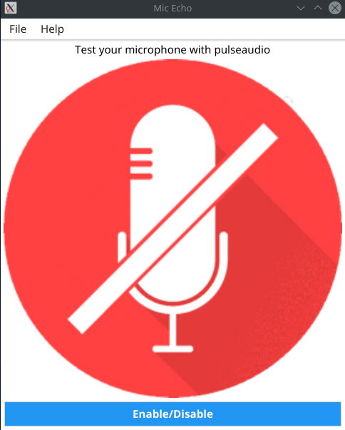

# mic_echo

---

Test microphone if you are using pulseaudio on linux

Desktop aplication | Go + Fyne

<!-- Show image -->

## Pre-requisites

Install Go in 1.17 version minimum.

## Run and test the app

`$ go run main.go`

## Build the app

`$ go build`

## give permissions

`$ sudo chmod a+x mic_echo`

## run

`$ ./mic_echo`

You can move to usr/bin to run from any location
